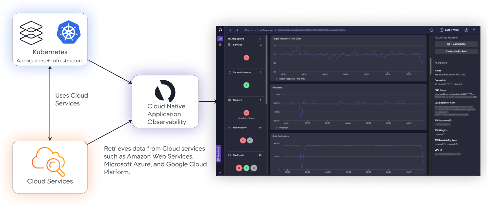
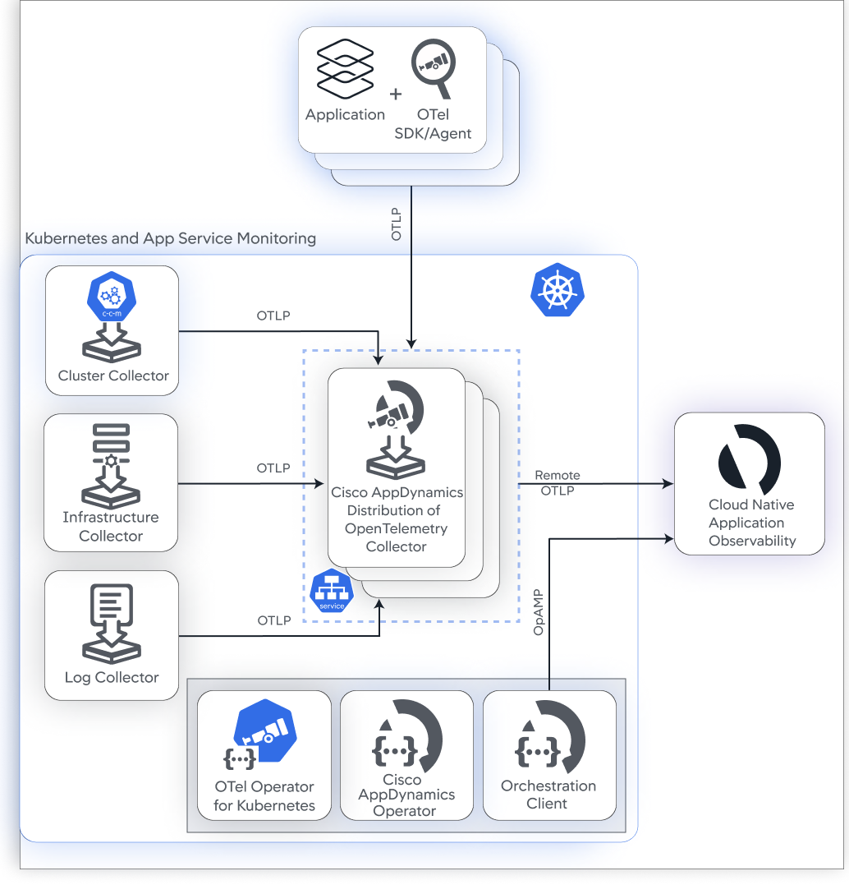

# Cisco Cloud Observability Add-On for Amazon EKS Blueprints

The Cisco Cloud Observability Add-On for [Amazon EKS Blueprints](https://github.com/aws-ia/terraform-aws-eks-blueprints) 
enables platform administrators to install the 
[Kubernetes and App Service Monitoring](https://docs.appdynamics.com/observability/cisco-cloud-observability/en/kubernetes-and-app-service-monitoring) 
solution for 
[Cisco Cloud Observability](https://docs.appdynamics.com/observability/cisco-cloud-observability/en/about-cisco-cloud-observability) 
using Helm charts via Terraform.  

## Introduction

Cisco Cloud Observability is Cisco’s Software-as-a-Service (SaaS) product for observing, securing, and optimizing 
large, managed Kubernetes deployments. It provides real-time observability across your entire technology stack: applications, 
software-defined compute, storage, services, network, and other infrastructure, through the collection and correlation of metrics, 
events, logs, and traces (MELT).  

This illustration shows a high-level overview of how Cisco Cloud Observability works:

The Kubernetes and App Service Monitoring solution provides visibility into your Kubernetes infrastructure and services for 
Application Performance Monitoring (APM).  

Kubernetes and App Service Monitoring allows you to:

-	Gain visibility into key Kubernetes metrics from various entities such as clusters, namespaces, workloads, pods, and ingress controllers.
-	Monitor hardware metrics from the server OS such as CPU and memory utilization, throughput on network interfaces, and disk and network I/O.
-	Correlate your Kubernetes infrastructure entities with your public cloud assets such as compute, storage, and load balancer, as well as APM services.
-	Monitor the Kubernetes events and application logs within your cluster.
-	Diagnose issues that may prevent uptime or obstruct scalability.

## Architecture Overview

The Cisco AppDynamics-provided Helm charts deploy the following components:

### Collectors

| Collector                                 | Usage                                                            |
|-------------------------------------------|------------------------------------------------------------------|
| Cluster Collector                         | Collects Kubernetes data.
| Infrastructure Collector                  | Collects server and container data, known as Host Monitoring.
| Log Collector                             | Collects logs.
| Cisco AppDynamics OpenTelemetry Collector | Receives OTLP data from the Infrastructure Collector, Cluster Collector, and Log Collector.

### Operators

| Operator                                  | Usage                                                            |
|-------------------------------------------|------------------------------------------------------------------|
| AppDynamics Operator                      | These two operators are responsible for the life-cycle management of `appdynamics-collectors` and allow you to inject and configure OpenTelemetry auto-instrumentation libraries. Currently, Java, NodeJS, and Python are supported for auto-injection.
| OpenTelemetry Operator for Kubernetes     |
| Orchestration Client                      | This operator is responsible for the life-cycle management of Kubernetes-related agents.

## Get Started

Before installing Kubernetes and App Service Monitoring solution, ensure that you meet the following requirements:

-	Your account is set up on Cisco Cloud Observability. See [Account Administration](https://docs.appdynamics.com/observability/cisco-cloud-observability/en/account-administration).
-	You are connected to the cluster that you want to monitor.
-	You have administrator privileges on the monitored cluster to run the Helm chart commands.

## Deploy the Cisco Cloud Observability Addon

The Cisco Cloud Observability Add-On for Amazon EKS Blueprints currently supports manual deployment to AWS EKS via Terraform. 
In the future, we will be adding support for deployment via the AWS EKS console.  

Click on the link below for step-by-step instructions to manually deploy the Cisco Cloud Observability Addon:

-	[Manual Steps for Installing the Cisco Cloud Observability Addon](https://docs.appdynamics.com/observability/cisco-cloud-observability/en/kubernetes-and-app-service-monitoring/install-kubernetes-and-app-service-monitoring-with-amazon-elastic-kubernetes-service/use-the-cisco-cloud-observability-amazon-eks-blueprints-add-on)
