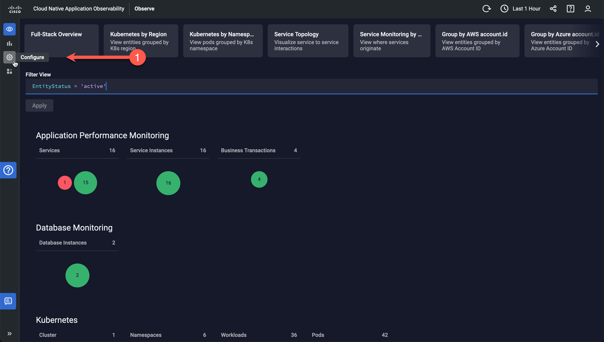
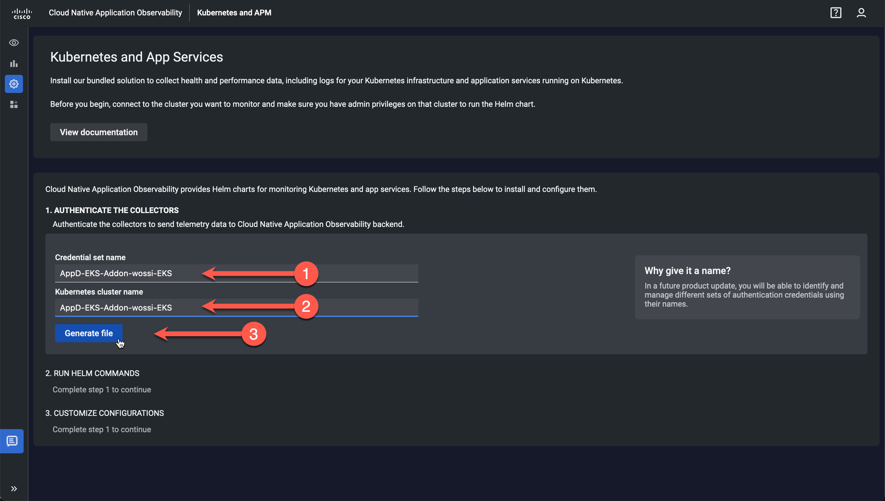
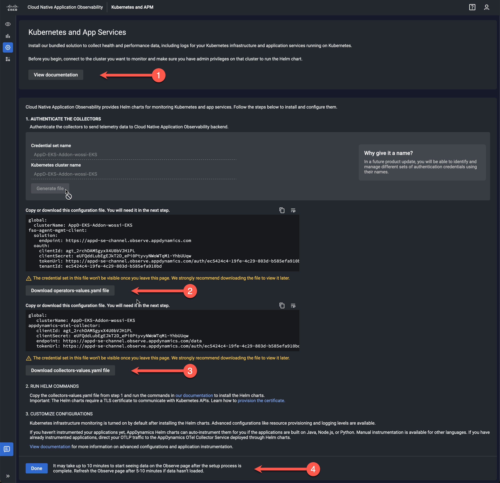

# AppDynamics Add-On for Amazon EKS Blueprints

The AppDynamics Add-On for [Amazon EKS Blueprints](https://github.com/aws-ia/terraform-aws-eks-blueprints) 
enables platform administrators to install the AppDynamics 
[Kubernetes and App Service Monitoring](https://docs.appdynamics.com/fso/cloud-native-app-obs/en/kubernetes-and-app-service-monitoring) 
solution for 
[Cloud Native Application Observability](https://docs.appdynamics.com/fso/cloud-native-app-obs/en/about-cloud-native-application-observability) 
using Helm charts via Terraform.  

Cloud Native Application Observability is Cisco’s software-as-a-service (SaaS) product for observing, securing, and optimizing 
large, managed Kubernetes deployments. It provides real-time observability across your entire technology stack: applications, 
software-defined compute, storage, services, network, and other infrastructure, through the collection and correlation of metrics, 
events, logs, and traces (MELT).  

This illustration shows a high-level overview of how Cloud Native Application Observability works:

**NOTE:** This project is currently a work-in-progress. Updates are expected soon! (mid-October 2023).

## Architecture Overview

The [Kubernetes and App Service Monitoring](https://docs.appdynamics.com/fso/cloud-native-app-obs/en/kubernetes-and-app-service-monitoring) 
solution provides visibility into your Kubernetes infrastructure and services for Application Performance Monitoring (APM) via 
AppDynamics-provided Helm charts. These Helm charts deploy the following components:

## Get Started

Before installing Kubernetes and App Service Monitoring solution, ensure that you meet the following requirements:

-	Your account is set up on Cloud Native Application Observability. See [Account Administration](https://docs.appdynamics.com/fso/cloud-native-app-obs/en/account-administration).
-	You are connected to the cluster that you want to monitor.
-	You have administrator privileges on the monitored cluster to run the Helm chart commands.

-	[Build Steps for Preparing the Workshop](docs/BUILD_STEPS_FOR_PREPARING_THE_WORKSHOP.md)

## Deployment Tools

In order to deploy the AppDynamics Add-On for Amazon EKS Blueprints, you will first need to install the 
following set of command-line utilities:

### AWS Command Line Interface (v2)

The [AWS Command Line Interface](https://docs.aws.amazon.com/cli/latest/userguide/cli-chap-welcome.html) 
(AWS CLI) is an open source tool that enables you to interact with AWS services using commands in your 
command-line shell. With minimal configuration, the AWS CLI enables you to start running commands that 
implement functionality equivalent to that provided by the browser-based AWS Management Console from the 
command prompt in your terminal program.  

The AWS CLI version 2 is the most recent major version of the AWS CLI and supports all of the latest 
features. Please see the 
[AWS CLI installation guide](https://docs.aws.amazon.com/cli/latest/userguide/getting-started-install.html) 
to get started.

### Terraform

[Terraform](https://terraform.io/) is a tool for building, changing, and versioning infrastructure 
safely and efficiently. Terraform can manage existing and popular service providers as well as custom 
in-house solutions. The infrastructure Terraform can manage includes low-level components such as compute 
instances, storage, and networking, as well as high-level components such as DNS entries, SaaS features, 
etc.  

Terraform is used to automate the deployment of the AppDynamics Add-On for Amazon EKS Blueprints.  
Installation guides for your platform can be found 
[here](https://developer.hashicorp.com/terraform/downloads).

### Helm

[Helm](https://helm.sh) is the package manager for [Kubernetes](https://kubernetes.io/) that streamlines 
installing and managing Kubernetes applications. Helm is the best way to find, share, and use software 
built for Kubernetes.  

The [Helm platform binaries](https://github.com/helm/helm/releases/latest/) can be downloaded from GitHub.

### Kubectl

[Kubectl](https://kubernetes.io/docs/reference/kubectl/) is a command-line tool 
used for communicating with the [Kubernetes](https://kubernetes.io/) API server to deploy and manage 
applications. Using `kubectl`, you can inspect cluster resources; create, delete, and update components; 
look at your new cluster; and bring up example apps.  

Instructions for 
[Installing or updating kubectl](https://docs.aws.amazon.com/eks/latest/userguide/install-kubectl.html) 
section of the Amazon EKS User Guide.  

**NOTE:** You must use a `kubectl` version that is within one minor version difference of your Amazon 
EKS cluster control plane. For example, a 1.26 `kubectl` client works with Kubernetes 1.25, 1.26, and 
1.27 clusters.

### yq

[yq](https://github.com/mikefarah/yq) is a lightweight and portable command-line YAML processor. `yq` uses 
[jq](https://github.com/stedolan/jq)-like syntax but works with YAML files as well as JSON, XML, 
properties, CSV and TSV. It doesn't yet support everything `jq` does-but it does support the most common 
operations and functions, and more are being added continuously.  

The [yq binaries](https://github.com/mikefarah/yq/releases/latest/) can be downloaded from GitHub.
