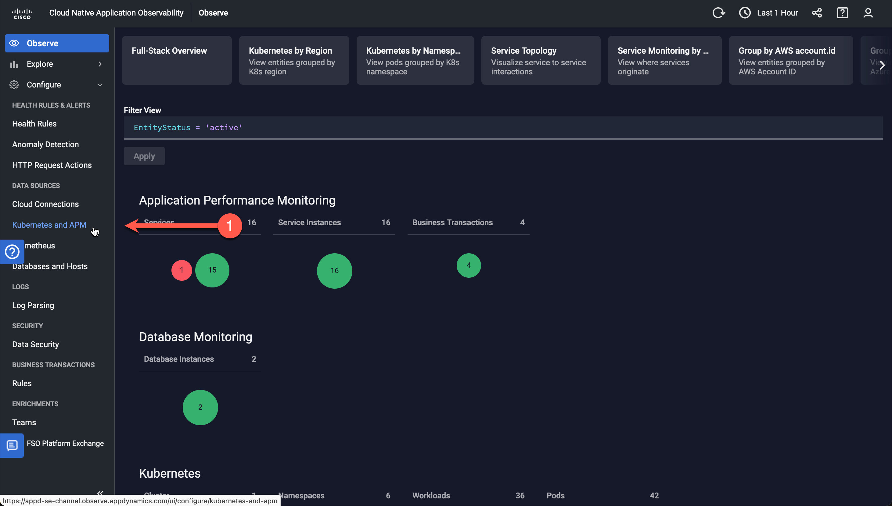

# Manual Steps for Installing the AppDynamics Addon
## Deployment Tools

In order to manually deploy the AppDynamics Add-On for Amazon EKS Blueprints, you will first need to install 
the following set of command-line utilities on either your local machine or a suitable VM:

### AWS Command Line Interface (v2)

The [AWS Command Line Interface](https://docs.aws.amazon.com/cli/latest/userguide/cli-chap-welcome.html) 
(AWS CLI) is an open source tool that enables you to interact with AWS services using commands in your 
command-line shell. With minimal configuration, the AWS CLI enables you to start running commands that 
implement functionality equivalent to that provided by the browser-based AWS Management Console from the 
command prompt in your terminal program.  

The AWS CLI version 2 is the most recent major version of the AWS CLI and supports all of the latest 
features. Please see the 
[AWS CLI installation guide](https://docs.aws.amazon.com/cli/latest/userguide/getting-started-install.html) 
to get started.

### Terraform

[Terraform](https://terraform.io/) is a tool for building, changing, and versioning infrastructure 
safely and efficiently. Terraform can manage existing and popular service providers as well as custom 
in-house solutions. The infrastructure Terraform can manage includes low-level components such as compute 
instances, storage, and networking, as well as high-level components such as DNS entries, SaaS features, 
etc.  

Terraform is used to automate the deployment of the AppDynamics Add-On for Amazon EKS Blueprints.  
Installation guides for your platform can be found 
[here](https://developer.hashicorp.com/terraform/downloads).

### Helm

[Helm](https://helm.sh) is the package manager for [Kubernetes](https://kubernetes.io/) that streamlines 
installing and managing Kubernetes applications. Helm is the best way to find, share, and use software 
built for Kubernetes.  

The [Helm platform binaries](https://github.com/helm/helm/releases/latest/) can be downloaded from GitHub.

### Kubectl

[Kubectl](https://kubernetes.io/docs/reference/kubectl/) is a command-line tool 
used for communicating with the [Kubernetes](https://kubernetes.io/) API server to deploy and manage 
applications. Using `kubectl`, you can inspect cluster resources; create, delete, and update components; 
look at your new cluster; and bring up example apps.  

Instructions for 
[Installing or updating kubectl](https://docs.aws.amazon.com/eks/latest/userguide/install-kubectl.html) 
section of the Amazon EKS User Guide.  

**NOTE:** You must use a `kubectl` version that is within one minor version difference of your Amazon 
EKS cluster control plane. For example, a 1.27 `kubectl` client works with Kubernetes 1.26, 1.27, and 
1.28 clusters.

### yq

[yq](https://github.com/mikefarah/yq) is a lightweight and portable command-line YAML processor. `yq` uses 
[jq](https://jqlang.github.io/jq/)-like syntax but works with YAML files as well as JSON, XML, 
properties, CSV and TSV. It doesn't yet support everything `jq` does-but it does support the most common 
operations and functions, and more are being added continuously.  

The [yq binaries](https://github.com/mikefarah/yq/releases/latest/) can be downloaded from GitHub.

## Get the Code

1.	Create a folder for your AppDynamics Add-On for Amazon EKS Blueprints project or use your home directory:

    ```bash
    cd
    ```

2.	Get the code from the Cisco DevNet repository on GitHub:

    ```bash
    git clone https://github.com/CiscoDevNet/appdynamics-eks-blueprints-addon.git
    cd appdynamics-eks-blueprints-addon
    ```

## Overview





## Build and Deployment Tools

Although there are many tools available to accomplish the project's automation goals, it was decided to 
standardize on [Packer](https://www.packer.io/), [Terraform](https://www.terraform.io/), and 
[Terraform Cloud](https://cloud.hashicorp.com/products/terraform) from HashiCorp. This is primarily due 
to their capability for building and deploying software platforms to multi-cloud environments, as well 
as having a high level of adoption within the developer community.

### Packer

[Packer](https://packer.io/) is an open source tool for creating identical machine images for multiple 
platforms from a single source configuration. Packer is lightweight, runs on every major operating system, 
and is highly performant. A machine image (or immutable VM image) is a single static unit that contains 
a pre-configured operating system and installed software which is used to quickly create new running 
machines.  

As part of this project, Packer is used to create an immutable Lab VM image consisting of a standardized 
installation of Amazon Linux 2 with a set of common software. This static image is later used by Terraform 
when standing-up the infrastructure and compute resources needed by workshop participants. Currently, this 
VM consists of the following type:

-	__LPAD VM__: A 'Launchpad' Lab VM with pre-configured tooling for Kubernetes and AWS CLI Operations.

For SE-lead workshops, the Lab VM image is built and maintained by Cisco/AppDynamics. However, all of the 
artifacts used to build the image are present in this project, so customers are free to customize and 
build their own VM images if desired.  

### Terraform

[Terraform](https://terraform.io/) is a tool for building, changing, and versioning infrastructure 
safely and efficiently. Terraform can manage existing and popular service providers as well as custom 
in-house solutions. The infrastructure Terraform can manage includes low-level components such as compute 
instances, storage, and networking, as well as high-level components such as DNS entries, SaaS features, 
etc.  

In this project, Terraform is used to automate the deployment of the Lab infrastructure, including VPCs, 
subnets, security groups, load balancers, Kubdernetes clusters, and Lab VM using templates.

### Terraform Cloud

[Terraform Cloud](https://cloud.hashicorp.com/products/terraform) is HashiCorp’s managed service offering 
for Terraform. It eliminates the need for unnecessary tooling and documentation for practitioners, teams, 
and organizations to use Terraform in production.

## Get Started

To configure the FSO Lab workshop environments, the first step is to set-up your development environment 
by installing the needed software.

### Prerequisites

You install Packer and Terraform on a control node, usually your local laptop, which then uses the 
cloud CLI and/or SSH to communicate with your cloud resources and managed nodes.

__NOTE:__ A remote Virtual Machine with access to the internet can also be used as the control node. The 
specific instructions for installing the required software are left as an exercise for the reader.

## Installation Instructions - macOS

For macOS environments, the following open source software needs to be installed on the host macOS machine:

-	Homebrew 4.1.16
-	Git 2.42.0
-	Packer 1.9.4
-	Terraform 1.6.2
-	jq 1.7
-	yq 4.35.2

Perform the following steps to install the needed software:

1.	Install the [Homebrew 4.1.16](https://brew.sh/) package manager for macOS 64-bit. Paste the following into a macOS Terminal prompt:  
    ```bash
    /bin/bash -c "$(curl -fsSL https://raw.githubusercontent.com/Homebrew/install/master/install.sh)"
    ```

2.	Install [Git 2.42.0](https://git-scm.com/downloads) for macOS 64-bit.  
    ```bash
    brew install git
    ```

3.	Install [Packer 1.9.4](https://www.packer.io/downloads.html) for macOS 64-bit.  
    ```bash
    brew tap hashicorp/tap
    brew install hashicorp/tap/packer
    ```

4.	Install [Terraform 1.6.2](https://www.terraform.io/downloads.html) for macOS 64-bit.  
    ```bash
    brew tap hashicorp/tap
    brew install hashicorp/tap/terraform
    ```

5.	Install [jq 1.7](https://jqlang.github.io/jq/) for macOS 64-bit.  
    `brew install jq`  

6.	Install [yq 4.35.2](https://github.com/mikefarah/yq/) for macOS 64-bit.  
    `brew install yq`  

### Configuration and Validation - macOS

1.	Validate installed command-line tools:

    ```bash
    brew --version
    # Homebrew 4.1.16

    brew doctor
    # Your system is ready to brew.

    git --version
    # git version 2.42.0

    packer --version
    # 1.9.4

    terraform --version
    # Terraform v1.6.2

    jq --version
    # jq-1.7

    yq --version
    # yq (https://github.com/mikefarah/yq/) version v4.35.2
    ```

2.	Configure Git for local user:

    ```bash
    git config --global user.name "<first_name> <last_name>"
    git config --global user.email "<your_email>"
    git config --global --list
    ```

## Installation Instructions - Windows 64-Bit

Windows users have a wide variety of choice in terminals and shells for running the command-line tools, 
such as the Windows Command Prompt, [PowerShell](https://docs.microsoft.com/en-us/powershell/), 
[Windows Terminal](https://docs.microsoft.com/en-us/windows/terminal/get-started), 
[Git Bash](https://git-scm.com/download/win), and the 
[Windows Subsystem for Linux (WSL)](https://docs.microsoft.com/en-us/windows/wsl/about).  

Although you are free to use any of these tools, the installation steps described below will be based 
on the usage of the **Git Bash** terminal or the **Windows Subsystem for Linux (WSL)** with an Ubuntu 
installation.  

Here is a list of the recommended open source software to be installed on the host Windows machine:

-	Curl 7.68.0 (Ubuntu 64-bit only)
-	Wget 1.21.1 (Ubuntu 64-bit only)
-	Git 2.42.0
-	Packer 1.9.4
-	Terraform 1.6.2
-	jq 1.7
-	yq 4.35.2

### Git Bash installation - Windows 64-Bit

Perform the following steps to install the needed software:

1.	Install [Git 2.42.0](https://github.com/git-for-windows/git/releases/download/v2.42.0.windows.2/Git-2.42.0.2-64-bit.exe) for Windows 64-bit.

2.	Install [Packer 1.9.4](https://releases.hashicorp.com/packer/1.9.4/packer_1.9.4_windows_amd64.zip) for Windows 64-bit.  
    Create suggested install folder and extract contents of ZIP file to:  
    `C:\HashiCorp\bin`  

3.	Install [Terraform 1.6.2](https://releases.hashicorp.com/terraform/1.6.2/terraform_1.6.2_windows_amd64.zip) for Windows 64-bit.  
    Create suggested install folder and extract contents of ZIP file to:  
    `C:\HashiCorp\bin`  

4.	Install [jq 1.7](https://github.com/jqlang/jq/releases/download/jq-1.7/jq-win64.exe) for Windows 64-bit.  
    Create suggested install folder and rename binary to:  
    `C:\Program Files\Git\usr\local\bin\jq.exe`

5.	Install [yq 4.35.2](https://github.com/mikefarah/yq/releases/download/v4.35.2/yq_windows_amd64.exe) for Windows 64-bit.  
    Create suggested install folder and rename binary to:  
    `C:\Program Files\Git\usr\local\bin\yq.exe`

### Configuration and Validation - Windows 64-Bit

1.	Set Windows Environment `PATH` to:

    ```bash
    PATH=C:\HashiCorp\bin;C:\Program Files\Git\usr\local\bin;%PATH%
    ```

2.	Reboot Windows.

3.	Launch Git Bash.  
    Start Menu -- > All apps -- > Git -- > Git Bash

4.	Validate installed command-line tools:

    ```bash
    git --version
    # git version 2.42.0.windows.2

    packer --version
    # 1.9.4

    terraform --version
    # Terraform v1.6.2

    jq --version
    # jq-1.7

    yq --version
    # yq (https://github.com/mikefarah/yq/) version v4.35.2
    ```

5.	Configure Git for local user:

    ```bash
    git config --global user.name "<first_name> <last_name>"
    git config --global user.email "<your_email>"
    git config --global --list
    ```

### Windows Subsystem for Linux (WSL) installation - Ubuntu 64-Bit

1.	Install [Curl 7.68.0](http://manpages.ubuntu.com/manpages/trusty/man1/curl.1.html) for Ubuntu 64-bit.  
    ```bash
    sudo apt install curl
    ```

2.	Install [Wget 1.21.1](https://www.gnu.org/software/wget/manual/wget.html) for Ubuntu 64-bit.  
    ```bash
    sudo apt install wget
    ```

3.	Install [Git 2.42.0](https://git-scm.com/downloads) for Ubuntu 64-bit.  
    ```bash
    sudo apt install git
    ```

4.	Install [Packer 1.9.4](https://www.packer.io/downloads.html) for Ubuntu 64-bit.  
    ```bash
    cd /usr/local/bin
    sudo wget https://releases.hashicorp.com/packer/1.9.4/packer_1.9.4_linux_amd64.zip
    sudo unzip packer_1.9.4_linux_amd64.zip
    sudo rm -i packer_1.9.4_linux_amd64.zip
    ```

5.	Install [Terraform 1.6.2](https://www.terraform.io/downloads.html) for Ubuntu 64-bit.  
    ```bash
    cd /usr/local/bin
    sudo wget https://releases.hashicorp.com/terraform/1.6.2/terraform_1.6.2_linux_amd64.zip
    sudo unzip terraform_1.6.2_linux_amd64.zip
    sudo rm -i terraform_1.6.2_linux_amd64.zip
    ```

6.	Install [jq 1.7](https://jqlang.github.io/jq/) for Ubuntu 64-bit.  
    ```bash
    sudo apt install jq
    ```

7.	Install [yq 4.35.2](https://github.com/mikefarah/yq/) for Ubuntu 64-bit.  
    ```bash
    sudo apt install yq
    ```


### Configuration and Validation - Ubuntu 64-Bit

1.	Validate installed command-line tools:

    ```bash
    git --version
    # git version 2.42.0

    packer --version
    # 1.9.4

    terraform --version
    # Terraform v1.6.2

    jq --version
    # jq-1.7

    yq --version
    # yq (https://github.com/mikefarah/yq/) version v4.35.2
    ```

2.	Configure Git for local user:

    ```bash
    git config --global user.name "<first_name> <last_name>"
    git config --global user.email "<your_email>"
    git config --global --list
    ```

## Get the Code

1.	Create a folder for your FSO Lab DevOps project or use your home directory:

    ```bash
    cd ~
    ```

2.	Get the code from GitHub:

    ```bash
    git clone https://github.com/APO-SRE/fso-lab-devops.git
    cd fso-lab-devops
    ```

## Build the VM Image and Deploy the Lab Infrastructure

The FSO Lab DevOps project currently supports a VM image build for Amazon AWS. Click on the link below 
for platform-specific instructions and a Bill-of-Materials:

-	[AWS Build and Deploy](AWS_VM_BUILD_INSTRUCTIONS.md): Instructions
